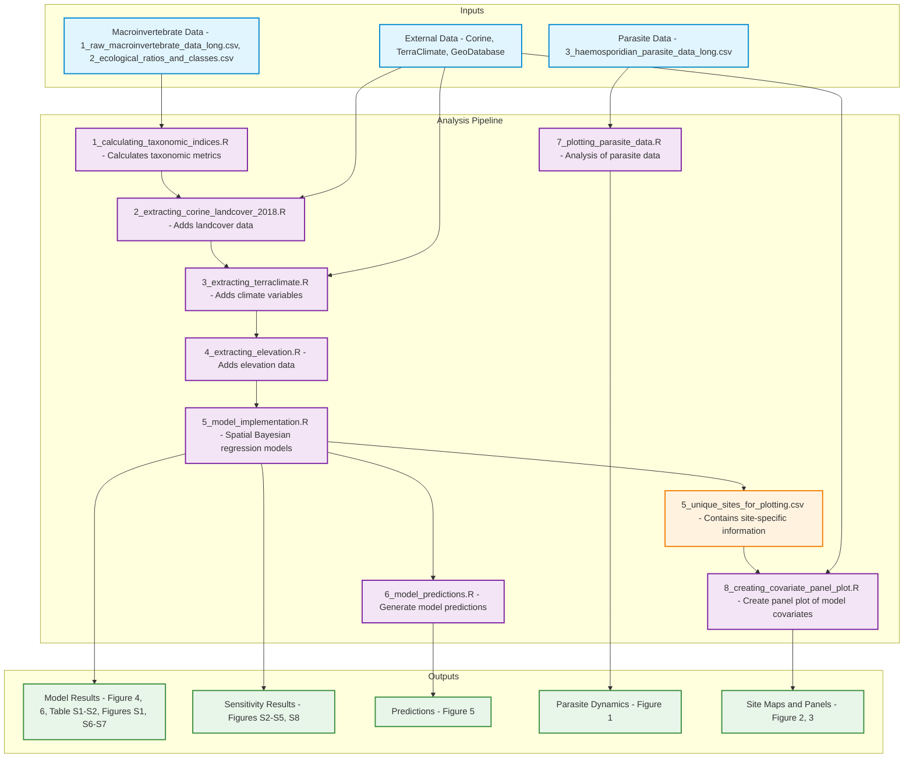

# Predicting_vector_abundance_in_Lithuania

Using hierarchical spatial-temporal models implemented in R-INLA to understand and predict patterns of insect vector abundance in Lithuanian lakes and rivers

R-code to reproduce analysis in Baker & Palinauskas (n.d.). Ecological integrity drives increased abundances of insect vectors (Culicidae, Simuliidae, Ceratopogonidae). Submitted to Parasites & Vectors

# Diptera Taxonomic Analysis Project

## Overview
This repository contains the complete analysis pipeline for analyzing Diptera taxonomic indices across different environmental conditions. The analysis consists of 8 sequential R scripts that must be run in order due to data dependencies.

## Prerequisites
- R (version ≥ 4.4.3)
- RStudio (version 2024.12.1)
- Required R packages (listed in each script)
- Access to external datasets (see Data Requirements below)

## Repository Structure
```
├── Data/
│   ├── 1_raw_macroinvertebrate_data_long.csv
│   ├── 2_ecological_ratios_and_classes.csv
│   └── 3_haemosporidian_parasite_data_long.csv
├── Outputs/
│   └── 1_diptera_taxonomic_indices.csv
│   └── 2_diptera_taxonomic_indices_wCorine2018.csv
│   └── 3_diptera_taxonomic_indices_wCorine2018_TerraClimate.csv
│   └── 4_diptera_taxonomic_indices_wCorine2018_TerraClimate_elevation.csv
│   └── 5_unique_sites_for_plotting.csv
├── Plots/
│   └── Baker_et.al._2024_trends.rds
│   └── Figure1_parasite_prevalence_dynamics.RDS
│   └── Figure1_parasite_prevalence_dynamics.png
│   └── Figure2_Sampling_sites_wWater.png
│   └── Figure3_covariate_panel_plot.png
│   └── Figure4_fixed_effects.png
│   └── Figure5_predicted_fixed_effects_without_spatial.png
│   └── Figure6_SRF_spatial_dependency.png
│   └── TableS2_tabluated_model_output.png
│   └── FigureS1_distances_between_sites.png
│   └── FigureS6_imposed_matern_correlation.png
│   └── FigureS7_fixed _effect_model_comparisons.png
├── Sensitivity/
│   └── FigureS2_sensisitivity_mesh_comparison.png
│   └── FigureS3.1_sensitivity_DIC_values.png
│   └── FigureS3.2_sensitivity_range_estimates.png
│   └── FigureS3.3_sensitivity_MaternCorrelation1.png
│   └── FigureS3.4_sensitivity_MaternCorrelation2.png
│   └── FigureS4_sensitivity_SpatialRandomField.png
│   └── FigureS5_sensitivity_RegressionParameters.png
│   └── FigureS8_DensityDistribution_PCPriors.png
├── Additional data/ (hidden in .gitignore)
│   └── Corine2018/ (user must download)
│   └── Corine Landcover/
│   └── GeoDatabase/
│   └── TerraClimate/
├── Scripts/
│   ├── 1_calculating_taxonomic_indices.R
│   ├── 2_extracting_corine_landcover_2018.R
│   ├── 3_extracting_terraclimate.R
│   ├── 4_extracting_elevation.R
│   ├── 5_model_implementation.R
│   ├── 6_model_predictions.R
│   ├── 7_plotting_parasite_data.R
│   └── 8_creating_covariate_panel_plot.R
└── README.md
```

## Data Requirements
Some datasets are too large for GitHub and must be downloaded separately:

1. **Corine Landcover 2018**
   - Download from: https://land.copernicus.eu/en/products/corine-land-cover
   - Place in: `Corine2018/` directory
   
2. **TerraClimate Data**
   - Download instructions provided in script: `3_extracting_terraclimate.R`
   - Place in: `Additional data/TerraClimate/`

3. **Lithuanian Rivers Shapefile** (optional)
   - Request access from Lithuanian Environmental Protection Agency
   - Place in: `Additional data/GeoDatabase/`

## Analysis Workflow

### Step 1: Calculate Taxonomic Indices
**Script:** `1_calculating_taxonomic_indices.R`
- **Input:** 
  - `Data/1_raw_macroinvertebrate_data_long.csv`
  - `Data/2_ecological_ratios_and_classes.csv`
- **Output:** `Outputs/1_diptera_taxonomic_indices.csv`

### Step 2: Extract Corine Landcover Data
**Script:** `2_extracting_corine_landcover_2018.R`
- **Input:**
  - `Outputs/1_diptera_taxonomic_indices.csv`
  - `Corine2018/u2018_clc2018_v2020_20u1_raster100m/DATA/U2018_CLC2018_V2020_20u1.tif`
  - `Additional data/Corine Landcover/clc_legend.csv`
  - `Additional data/Corine Landcover/CLC2018_CLC2018_V2018_20_QGIS.txt`
- **Output:** `Outputs/2_diptera_taxonomic_indices_wCorine2018.csv`
- **Warning:** User must download Corine Landcover data, also, I use the Corine 2012 legend "clc_legend.csv" to match names.

### Step 3: Extract TerraClimate Data
**Script:** `3_extracting_terraclimate.R`
- **Input:**
  - `Outputs/2_diptera_taxonomic_indices_wCorine2018.csv`
  - `Additional data/TerraClimate/linked_terraclimate_data.RDS`
- **Output:** `Outputs/3_diptera_taxonomic_indices_wCorine2018_TerraClimate.csv`
- **Warning:** User must download TerraClimate data - Can take a while

### Step 4: Extract Elevation Data
**Script:** `4_extracting_elevation.R`
- **Input:** `Outputs/3_diptera_taxonomic_indices_wCorine2018_TerraClimate.csv`
- **Output:** `Outputs/4_diptera_taxonomic_indices_wCorine2018_TerraClimate_elevation.csv`

### Step 5: Implement Model
**Script:** `5_model_implementation.R`
- **Input:** `Outputs/4_diptera_taxonomic_indices_wCorine2018_TerraClimate_elevation.csv`
- **Output:** 
  - `Outputs/5_unique_sites_for_plotting.csv`
  - Main plots: `Figure4`, `Figure6`
  - Supplement plots: `TableS2`, `FigureS1`, `FigureS6`, `FigureS7`
  - Sensitivity plots: Multiple figures (S2-S8)
- **Warning:** If `rgeoboundaries` fails, use `rnaturalearth` package

### Step 6: Generate Model Predictions
**Script:** `6_model_predictions.R`
- **Input:** `Outputs/4_diptera_taxonomic_indices_wCorine2018_TerraClimate_elevation.csv`
- **Output:** `Plots/Figure5_predicted_fixed_effects_without_spatial.png`

### Step 7: Plot Parasite Data
**Script:** `7_plotting_parasite_data.R`
- **Input:** `Data/3_haemosporidian_parasite_data_long.csv`
- **Output:** 
  - `Plots/Figure1_parasite_prevalence_dynamics.png`
  - `Plots/Figure1_parasite_prevalence_dynamics.RDS`

### Step 8: Create Covariate Panel Plot
**Script:** `8_creating_covariate_panel_plot.R`
- **Input:**
  - `Outputs/5_unique_sites_for_plotting.csv`
  - `Additional data/GeoDatabase/UETK_2024-05-02.gdb`
  - Corine and TerraClimate data
- **Output:** 
  - `Plots/Figure2_Sampling_sites_wWater.png`
  - `Plots/Figure3_covariate_panel_plot.png`
- **Warning:** Lithuanian river shapefile optional; TerraClimate required

## Workflow Diagram



## Running the Analysis
1. Clone this repository
2. Download required external datasets (see Data Requirements)
3. Run scripts sequentially from 1 to 8
4. Output plots and files will be generated in respective directories

## Troubleshooting
- **Package Loading Issues:** If `rgeoboundaries` fails, use `rnaturalearth` as alternative
- **Missing Data:** Ensure all external datasets are downloaded and placed in correct directories
- **Memory Issues:** Some operations may require significant memory; close other applications if needed

## Citation
Baker & Palinauskas (n.d.). Ecological integrity drives increased abundances of insect vectors (Culicidae, Simuliidae, Ceratopogonidae). Submitted to Parasites & Vectors

## Contact
Nathan Jay Baker
nathan.baker@gamtc.lt

## License
CC0-1.0 license
