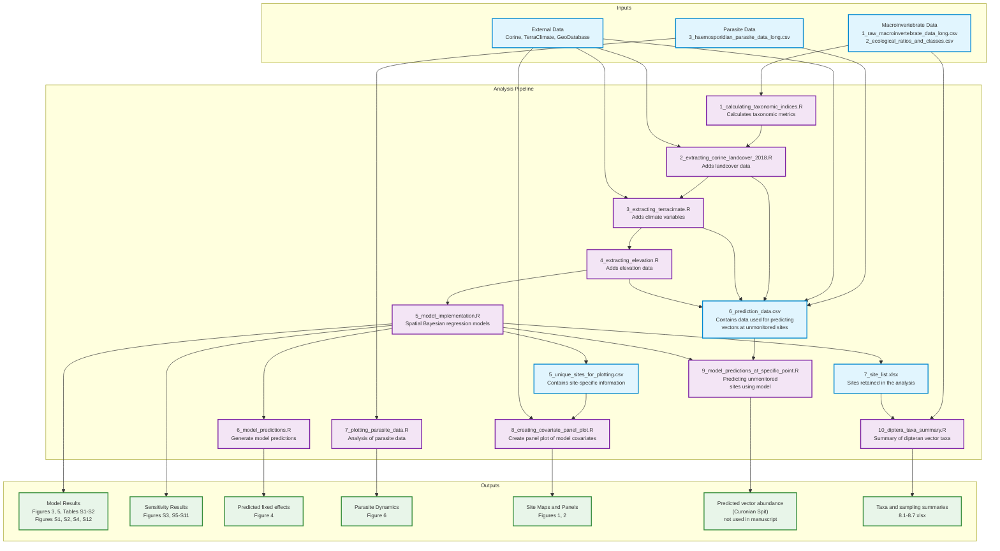

# Predicting_vector_abundance_in_Lithuania

Using hierarchical spatial-temporal models implemented in R-INLA to
understand and predict patterns of insect vector abundance in Lithuanian
lakes and rivers

R-code to reproduce analysis in Baker & Palinauskas (n.d.). Spatially 
heterogenous distributions of dipteran abundances identify priority areas for 
haemosporidian parasite surveillance. Submitted to Scientific Reports

# Diptera Taxonomic Analysis Project

## Overview

This repository contains the complete analysis pipeline for analyzing
Diptera taxonomic indices across different environmental conditions. The
analysis consists of 10 sequential R scripts that must be run in order
due to data dependencies.

File names in `Plots/` and `Sensitivity/` follow the figure and table
numbering used in the manuscript and its supplement.

## Prerequisites

-   R (version ≥ 4.4.3; last run with R 4.5.2)
-   RStudio (version 2024.12.1)
-   R-INLA, installed from <https://www.r-inla.org/download-install>
-   Required R packages (listed in each script)
-   Access to external datasets (see Data Requirements below)

## Repository Structure

```         
├── Data/
│   ├── 1_raw_macroinvertebrate_data_long.csv
│   ├── 2_ecological_ratios_and_classes.csv
│   └── 3_haemosporidian_parasite_data_long.csv
├── Outputs/
│   └── 1_diptera_taxonomic_indices.csv
│   └── 2_diptera_taxonomic_indices_wCorine2018.csv
│   └── 3_diptera_taxonomic_indices_wCorine2018_TerraClimate.csv
│   └── 4_diptera_taxonomic_indices_wCorine2018_TerraClimate_elevation.csv
│   └── 5_unique_sites_for_plotting.csv
│   └── 6_prediction_data.csv
│   └── 7_site_list.xlsx
│   └── 8.1_diptera_taxa_summary.xlsx
│   └── 8.2_diptera_overall_summary.xlsx
│   └── 8.3_diptera_family_summary.xlsx
│   └── 8.4_diptera_waterbody_summary.xlsx
│   └── 8.5_sampling_design_summary.xlsx
│   └── 8.6_sampling_months_summary.xlsx
│   └── 8.7_diptera_id_level_summary.xlsx
├── Plots/
│   └── Baker_et.al._2024_trends.rds (used in the script 5 data description)
│   └── Figure1_parasite_prevalence_dynamics.RDS (used in the script 5 data description)
│   └── Figure1_Sampling_sites_wWater.png
│   └── Figure2_covariate_panel_plot.png
│   └── Figure3_fixed_effects.png
│   └── Figure4_predicted_fixed_effects_without_spatial.png
│   └── Figure5_SRF_spatial_dependency.png
│   └── Figure6_parasite_prevalence_dynamics.RDS
│   └── Figure6_parasite_prevalence_dynamics.png
│   └── Figure12_predicted_vector_abundance.png (not used in the manuscript)
│   └── FigureS1_fixed _effect_model_comparisons.png
│   └── FigureS2_distances_between_sites.png
│   └── FigureS4_imposed_matern_correlation.png
│   └── FigureS12_seasonal_site_model_comparison.png
│   └── TableS1_model_comparison.html
│   └── TableS2_seasonal_site_model_comparison.html
├── Sensitivity/
│   └── FigureS3_DensityDistribution_PCPriors.png
│   └── FigureS5_sensitivity_mesh_comparison.png
│   └── FigureS6_sensitivity_DIC_values.png
│   └── FigureS7_sensitivity_range_estimates.png
│   └── FigureS8_sensitivity_MaternCorrelation1.png
│   └── FigureS9_sensitivity_MaternCorrelation2.png
│   └── FigureS10_sensitivity_SpatialRandomField.png
│   └── FigureS11_sensitivity_RegressionParameters.png
├── Additional data/ (hidden in .gitignore)
│   └── Corine2018/ (user must download)
│   └── Corine Landcover/
│   └── GeoDatabase/
│   └── TerraClimate/
├── Additional functions/
│   └── HighstatLibV15.R (support functions sourced by scripts 5, 6 and 9)
├── R Scripts/
│   ├── 1_calculating_taxonomic_indices.R
│   ├── 2_extracting_corine_landcover_2018.R
│   ├── 3_extracting_terracimate.R
│   ├── 4_extracting_elevation.R
│   ├── 5_model_implementation.R
│   ├── 6_model_predictions.R
│   ├── 7_plotting_parasite_data.R
│   └── 8_creating_covariate_panel_plot.R
│   └── 9_model_predictions_at_specific_point.R
│   └── 10_diptera_taxa_summary.R
└── README.md
```

## Data Requirements

Some datasets are too large for GitHub and must be downloaded
separately:

1.  **Corine Landcover 2018**
    -   Download from:
        <https://land.copernicus.eu/en/products/corine-land-cover>
    -   Place in: `Corine2018/` directory
    -   The path to the raster is hard-coded in
        `2_extracting_corine_landcover_2018.R` and must be edited
2.  **TerraClimate Data**
    -   Download instructions provided in script:
        `3_extracting_terracimate.R`
    -   Place in: `Additional data/TerraClimate/`
3.  **Lithuanian Rivers Shapefile** (optional)
    -   Request access from Lithuanian Environmental Protection Agency
    -   Place in: `Additional data/GeoDatabase/`
4.  **Google Maps Elevation API key**
    -   Required by `4_extracting_elevation.R`; add your own key where
        the script reads `"YOUR KEY HERE"`

## Analysis Workflow

### Step 1: Calculate Taxonomic Indices

**Script:** `1_calculating_taxonomic_indices.R` - **Input:** -
`Data/1_raw_macroinvertebrate_data_long.csv` -
`Data/2_ecological_ratios_and_classes.csv` - **Output:**
`Outputs/1_diptera_taxonomic_indices.csv`

### Step 2: Extract Corine Landcover Data

**Script:** `2_extracting_corine_landcover_2018.R` - **Input:** -
`Outputs/1_diptera_taxonomic_indices.csv` -
`Corine2018/u2018_clc2018_v2020_20u1_raster100m/DATA/U2018_CLC2018_V2020_20u1.tif` -
`Additional data/Corine Landcover/clc_legend.csv` -
`Additional data/Corine Landcover/CLC2018_CLC2018_V2018_20_QGIS.txt` -
**Output:** `Outputs/2_diptera_taxonomic_indices_wCorine2018.csv` - 
`6_prediction_data.csv` -
**Warning:** User must download Corine Landcover data, also, I use the
Corine 2012 legend "clc_legend.csv" to match names.

### Step 3: Extract TerraClimate Data

**Script:** `3_extracting_terracimate.R` - **Input:** -
`Outputs/2_diptera_taxonomic_indices_wCorine2018.csv` -
`Additional data/TerraClimate/linked_terraclimate_data.RDS` -
**Output:**
`Outputs/3_diptera_taxonomic_indices_wCorine2018_TerraClimate.csv` -
`6_prediction_data.csv` -
**Warning:** User must download TerraClimate data - Can take a while

### Step 4: Extract Elevation Data

**Script:** `4_extracting_elevation.R` - **Input:**
`Outputs/3_diptera_taxonomic_indices_wCorine2018_TerraClimate.csv` -
**Output:**
`Outputs/4_diptera_taxonomic_indices_wCorine2018_TerraClimate_elevation.csv` -
`6_prediction_data.csv` -
**Warning:** Requires your own Google Maps Elevation API key. Steps 2 to 4
each rebuild `6_prediction_data.csv`, so they must be run as a set.

### Step 5: Implement Model

**Script:** `5_model_implementation.R` - **Input:**
`Outputs/4_diptera_taxonomic_indices_wCorine2018_TerraClimate_elevation.csv` -
**Output:** - `Outputs/5_unique_sites_for_plotting.csv` -
`Outputs/7_site_list.xlsx` - Main plots: `Figure3`, `Figure5` -
Supplement: `TableS1`, `TableS2`, `FigureS1`, `FigureS2`, `FigureS4`,
`FigureS12` - Sensitivity plots: `FigureS3`, `FigureS5` to `FigureS11` -
**Warning:** If `rgeoboundaries` fails, use `rnaturalearth` package. The
full script takes a few hours, mostly the 30 models of the sensitivity
analysis (Section 18).

### Step 6: Generate Model Predictions

**Script:** `6_model_predictions.R` - **Input:**
`Outputs/4_diptera_taxonomic_indices_wCorine2018_TerraClimate_elevation.csv` -
**Output:** `Plots/Figure4_predicted_fixed_effects_without_spatial.png`

### Step 7: Plot Parasite Data

**Script:** `7_plotting_parasite_data.R` - **Input:**
`Data/3_haemosporidian_parasite_data_long.csv` - **Output:** -
`Plots/Figure6_parasite_prevalence_dynamics.png` -
`Plots/Figure6_parasite_prevalence_dynamics.RDS`

### Step 8: Create Covariate Panel Plot

**Script:** `8_creating_covariate_panel_plot.R` - **Input:** -
`Outputs/5_unique_sites_for_plotting.csv` -
`Additional data/GeoDatabase/UETK_2024-05-02.gdb` - Corine and
TerraClimate data - **Output:** -
`Plots/Figure1_Sampling_sites_wWater.png` -
`Plots/Figure2_covariate_panel_plot.png` - **Warning:** Lithuanian river
shapefile optional; TerraClimate required

### Step 9: Predict at an Unmonitored Site

**Script:** `9_model_predictions_at_specific_point.R` - **Input:** -
`Outputs/4_diptera_taxonomic_indices_wCorine2018_TerraClimate_elevation.csv`
(to refit the model) - `Outputs/6_prediction_data.csv` -
**Output:** - `Plots/Figure12_predicted_vector_abundance.png` - 
**Note:** This figure is no longer used in the manuscript -
**Warning:** If `rgeoboundaries` fails, use `rnaturalearth` package

### Step 10: Summarise Dipteran Vector Taxa

**Script:** `10_diptera_taxa_summary.R` - **Input:** -
`Data/1_raw_macroinvertebrate_data_long.csv` -
`Outputs/7_site_list.xlsx` (written in step 5) - **Output:** -
`Outputs/8.1_diptera_taxa_summary.xlsx` to
`Outputs/8.7_diptera_id_level_summary.xlsx` - **Note:** Reproduces the
descriptive statistics reported for the three vector families
(Ceratopogonidae, Simuliidae, Culicidae) over 2013-2022

## Workflow Diagram


``` mermaid
%%{init: {'themeVariables': { 'fontSize': '12px'}}}%%
%%{init: {'themeVariables': { 'nodePadding': 14}}}%%
graph TD
    subgraph Inputs
        R["Macroinvertebrate Data<br/>1_raw_macroinvertebrate_data_long.csv<br/>2_ecological_ratios_and_classes.csv"]
        P["Parasite Data<br/>3_haemosporidian_parasite_data_long.csv"]
        E["External Data<br/>Corine, TerraClimate, GeoDatabase"]
    end
    
    subgraph Analysis Pipeline
        R --> S1["1_calculating_taxonomic_indices.R<br/>Calculates taxonomic metrics"]
        S1 --> S2["2_extracting_corine_landcover_2018.R<br/>Adds landcover data"]
        E --> S2
        S2 --> S3["3_extracting_terracimate.R<br/>Adds climate variables"]
        E --> S3
        S3 --> S4["4_extracting_elevation.R<br/>Adds elevation data"]
        S4 --> S5["5_model_implementation.R<br/>Spatial Bayesian regression models"]
        S5 --> S6["6_model_predictions.R<br/>Generate model predictions"]
        S5 --> Sites["5_unique_sites_for_plotting.csv<br/>Contains site-specific information"]
        S5 --> SiteList["7_site_list.xlsx<br/>Sites retained in the analysis"]
        Sites --> S8["8_creating_covariate_panel_plot.R<br/>Create panel plot of model covariates"]
        E --> S8
        P --> S7["7_plotting_parasite_data.R<br/>Analysis of parasite data"]
        P --> Predictions["6_prediction_data.csv<br/>Contains data used for predicting<br/>vectors at unmonitored sites"]
        E --> Predictions
        S2 --> Predictions
        S3 --> Predictions
        S4 --> Predictions
        Predictions --> S9["9_model_predictions_at_specific_point.R<br/>Predicting unmonitored<br/>sites using model"]
        S5 --> S9
        R --> S10["10_diptera_taxa_summary.R<br/>Summary of dipteran vector taxa"]
        SiteList --> S10
    end
    
    subgraph Outputs
        S5 --> O1["Model Results<br/>Figures 3, 5, Tables S1-S2<br/>Figures S1, S2, S4, S12"]
        S5 --> O2["Sensitivity Results<br/>Figures S3, S5-S11"]
        S6 --> O3["Predicted fixed effects<br/>Figure 4"]
        S7 --> O4["Parasite Dynamics<br/>Figure 6"]
        S8 --> O5["Site Maps and Panels<br/>Figures 1, 2"]
        S9 --> O6["Predicted vector abundance<br/>(Curonian Spit)<br/>not used in manuscript"]
        S10 --> O7["Taxa and sampling summaries<br/>8.1-8.7 xlsx"]
    end
    
    %% Styling
    classDef input fill:#e1f5fe,stroke:#0288d1,stroke-width:2px;
    classDef script fill:#f3e5f5,stroke:#7b1fa2,stroke-width:2px;
    classDef output fill:#e8f5e9,stroke:#388e3c,stroke-width:2px;
    classDef intermediate fill:#e1f5fe,stroke:#0288d1,stroke-width:2px;
    
    class R,P,E input;
    class S1,S2,S3,S4,S5,S6,S7,S8,S9,S10 script;
    class O1,O2,O3,O4,O5,O6,O7 output;
    class Sites,SiteList,Predictions intermediate;
```

## Running the Analysis

1.  Clone this repository
2.  Download required external datasets (see Data Requirements)
3.  Run scripts sequentially from 1 to 10
4.  Output plots and files will be generated in respective directories

## Troubleshooting

-   **Package Loading Issues:** If `rgeoboundaries` fails, use
    `rnaturalearth` as alternative
-   **Missing Data:** Ensure all external datasets are downloaded and
    placed in correct directories
-   **Memory Issues:** Some operations may require significant memory;
    close other applications if needed

## Citation

Baker & Palinauskas (n.d.). Spatially heterogenous distributions of dipteran 
abundances identify priority areas for haemosporidian parasite surveillance.
Submitted to Scientific Reports

## Contact

Nathan Jay Baker
[nathan.baker\@gamtc.lt](mailto:nathan.baker@gamtc.lt){.email}

## License

CC0-1.0 license
